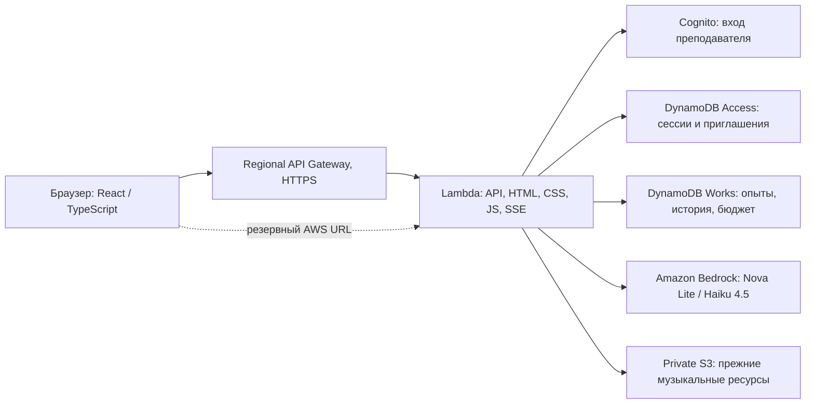

# AIたいけん: архитектура учебного эксперимента

Приложение для примерно 30 учеников, один урок — 60 минут. Регион AWS: Tokyo, ap-northeast-1. Инфраструктура остаётся в личном AWS-аккаунте, в отдельном стеке oc-ai-rpg-demo.

## Что делает ученик

Одна миссия: найти потерянный ключ и вернуть владельцу. Три места: рынок, фонтан, сад. Вариант A: ключ у фонтана. Вариант B: его перенесли в сад, у фонтана осталась подсказка.

| Режим     | Как выбирает действия                                                           | Что меняется в мире                                                                      |
| --------- | ------------------------------------------------------------------------------- | ---------------------------------------------------------------------------------------- |
| Программа | Шесть фиксированных команд                                                      | Сервер исполняет команды; при варианте B программа не справляется                        |
| Чат       | Модель отвечает на вопрос и учитывает инструкцию                                | Ничего: у чата нет права исполнять действия                                              |
| Агент     | Модель выбирает одну команду по цели, наблюдению и результатам предыдущих шагов | Сервер проверяет разрешённый инструмент и фактические условия, затем сохраняет результат |

Ученики меняют цель, модель Nova/Haiku, наличие памяти и разрешения инструментов. Каждый запуск сохраняет собственные условия, прогноз ученика, действия, результат, стоимость и вывод. Для корректного сравнения моделей нужно сохранять одинаковые условия; единичная попытка не является оценкой всей модели.

«1ステップ» выполняет один шаг. «最後まで» запускает последовательность в открытом браузере. «停止» закрывает эксперимент: уже оплаченный ответ может дойти, но новое действие после остановки не применяется. «やり直す» создаёт новый опыт с исходным состоянием; предыдущий остаётся в архиве. Агент и чат ограничены 12 шагами на опыт, программа — шестью.

## Компоненты

CloudFront, EC2, VPC, NAT, ECS и RDS не используются. Региональный API Gateway REST вызывает потоковый Lambda proxy через InvokeWithResponseStream. Приложение поддерживает события REST v1 и Function URL v2, cookie и путь /demo/ у стандартного адреса шлюза. Под собственным доменом путь корневой.

DNS остаётся в お名前.com. ACM выдаёт сертификат для ai-taiken.shigorefu.com после подтверждения CNAME. Отдельный стек oc-ai-rpg-demo-domain привязывает имя к региональному шлюзу. Статический IP не нужен; DNS-настройка описана в DNS.md.

## Цикл агента

1. Сервер собирает цель, текущие доступные наблюдения и разрешённые инструменты.
2. При включённой памяти передаёт предыдущие действия и результаты текущего опыта, до 12 шагов; объяснения сокращаются до 120 символов. При выключенной памяти история не передаётся.
3. Bedrock выбирает одну команду: look, move, ask, take, give или finish. JSON используется только внутри протокола приложения; ученики пишут обычный текст.
4. Zod проверяет ответ. Игровой движок проверяет права, место, предмет и адресата. Неисполняемые действия дают видимую ошибку инструмента.
5. Только реальная передача имеющегося ключа торговцу на рынке засчитывает успех. Утверждение модели об успехе не изменяет результат.
6. Условия, переданный контекст, выбранная команда и фактический результат записываются атомарно.

Скрытое положение ключа и вариант карты не передаются модели. Карта и условия видны ученику, но это не означает, что ИИ получает эти данные. Журнал показывает входные данные и краткое описание выбранного действия, а не внутренний ход мыслей модели.

Инструкции режима чата отделены от инструкций агента; схема чата требует action=null. При невалидном ответе действие не применяется, фактический вызов оплачивается и сохраняется в счётчике. Для нового учебного протокола нет скрытой повторной генерации.

## Вход и сохранение

Cognito используется только учителем. Самостоятельная регистрация выключена. Пароли и AWS-ключи не попадают в браузер. Сессии — непрозрачные случайные cookie, HttpOnly, Secure, SameSite=Strict; записи API проверяют Origin и CSRF.

Учитель создаёт работу, выдаёт одноразовую ссылку другому устройству или передаёт текущий браузер через «生徒に渡す». При передаче учительский cookie отзывается. Час ученика начинается при активации. Сервер запрещает доступ сразу после срока; удаление записи через DynamoDB TTL может произойти позже.

В Works нет TTL: работа, старые NPC/диалоги и новые записи LABRUN сохраняются. Опыты хранятся отдельными элементами, а не растущим массивом внутри одной работы. Архив имеет пагинацию, экспорт включает все опыты. Существующие учителя и пароли при обновлении не меняются.

## Bedrock и ограничения

| Модель    | ID                                          | Вход / выход за миллион токенов |
| --------- | ------------------------------------------- | ------------------------------- |
| Nova Lite | amazon.nova-lite-v1:0                       | $0.072 / $0.288                 |
| Haiku 4.5 | jp.anthropic.claude-haiku-4-5-20251001-v1:0 | $1.10 / $5.50                   |

Nova работает в Tokyo, Japan-профиль Haiku — Tokyo/Osaka. Новая учебная схема допускает до 900 выходных токенов на вызов; текст ученика — до 1200 символов. Системные инструкции и формат одинаковы для обеих моделей внутри выбранного режима.

Один запрос на работу одновременно. UUID защищает от повторной оплаты повторно отправленной операции. Атомарная транзакция резервирует консервативную стоимость до запроса; после ответа учитывает фактические токены. Неизвестный результат списывается по резерву.

Ограничения: 60 вызовов на часовую сессию, оценочно $1 на сессию и $10 на календарный месяц Tokyo для AI всего приложения. Новые эксперименты не сбрасывают эти лимиты. Стоп также не обнуляет расходы. Учитель может отключить новые AI-вызовы.

Это оценочный лимит Bedrock, а не лимит полного счёта AWS. Налог, хранение, Lambda и трафик учитываются отдельно.

## Стоимость и квота

Консервативный пример: 30 учеников, по 60 вызовов за один урок в месяц, в среднем 2000 входных и 500 выходных токенов. AI: около $0.52 Nova или $8.91 Haiku. Прежний ориентир всего приложения $2–5 / $10–15 за такой месяц остаётся запасом, а не фиксированным тарифом. Короткие команды нового сценария обычно дешевле; фактические токены видны в эксперименте.

Regional REST API в Tokyo: $4.25 за миллион запросов на первом уровне. Например, 10 000 запросов добавят около $0.043, 50 000 — $0.213, без трафика и других сервисов. Нет выделенного сервера или ежемесячной платы за IP. Неэкспортируемый публичный ACM-сертификат, используемый API Gateway, отдельной платы не требует.

Источники: [API Gateway pricing](https://aws.amazon.com/api-gateway/pricing/), [Tokyo API Gateway price list](https://pricing.us-east-1.amazonaws.com/offers/v1.0/aws/AmazonApiGateway/current/ap-northeast-1/index.json), [ACM pricing](https://aws.amazon.com/certificate-manager/pricing/), [Bedrock pricing](https://aws.amazon.com/bedrock/pricing/). Цены проверены 2026-09-07.

Текущая квота Lambda аккаунта — 10 одновременных запусков. Заявка на увеличение ещё CASE_OPENED; 30 одновременных ответов реального Bedrock пока не подтверждены. Это отдельное ограничение от количества сохранённых учеников. Локальные тесты 30 параллельных операций проверяют целостность общего бюджета, а не квоту облака.

## Проверка

npm run check: типы, серверные тесты и production-сборка. Тесты охватывают права, TTL/срок доступа, бюджеты, идемпотентность, остановку во время ответа, изменение мира только через инструменты, скрытый контекст и оба варианта карты.

scripts/smoke-lab.ts создаёт отдельного временного преподавателя и проверяет настоящий HTTPS/Bedrock, обе модели, программу и чат, архив и передачу ученику. Удаляет только свои тестовые данные, сохраняя расходы. scripts/smoke-deployed.ts проверяет совместимость прежнего NPC API.

Визуальная проверка в браузере отдельно не выполнялась. Старые экспериментальные WebMCP-инструменты выбора NPC убраны из нового интерфейса.
